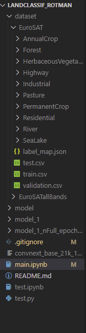

# Setup
**Strongly recommend NOT clicking 'Run All', and avoid running the `model.fit()` code block, unless you want to re-fit/re-train the model. Download the model files from SharePoint to see current results.**

# Directory strcture
- You probably want your folder/directory to look something like the screenshot shown below, so that the code won't have problem loading the images, saving/loading model files, etc. 

# Dataset
- The dataset downloaded from Kaggle (https://www.kaggle.com/datasets/apollo2506/eurosat-dataset) is pre-split into train:validation:test = 7:2:1. 
- Merged `train.csv` & `validation.csv` into 'train', then train_test_split() by 8:2. 
- `test.csv` will be left untouched till the very end. 

# Models
*exported model files/folders are synced via SharePoint, not GitHub. Please download models from SharePoint to your local directory so that the models load correctly.*

I admit the naming of models isn't great right now. Bare with me. 

## model_resnet50_nFull_epoch20_batch32_lr.00001 (2024/04/21)
- Ran another 10 epochs on top of the previous model, which means this model is obtained after 20 epochs, with a learning rate of 0.00001. 
- Validation accuracy now hovers around 45~55%, with some rather wide fluctuations. 

## model_resnet50_nFull_epoch10_batch32_lr.00001 (2024/04/21)
- keras pre-trained model: ResNet50 w Imagenet weights
- 1/10 of default learning rate, which increased validation accuracy to about 47%. The gap between validation and training accuracy is low, which suggests underfitting. 
- Had a lot difficulty bringing the model performance up. Default learning rate (0.0001) & batch_size (32) resulted in ~20% accuracy, while higher batch size + higher learning rate (64 & 0.001) resulted in 10~20% accuracy, which is horrible. 

# GridSearch (New, 2024/04/20)
Tried to do grid search but always have memory issues even when I'm only using 1k/24k images for the grid search. Using a subset is already a questionable decision for gird-search, yet it still crashes. Time to spend some money and make it work on Google Colab Pro, etc. Hopefully we will be able to run grid-search successfully with help from there. (Geran)

## model_1_nFull_epoch5_batch32 (2024/04/12)
- pre-trained model: convnext_base_21k_1k_224_fe
- All remain unchanged except a) reduced epochs to 5 (`epoch5`); b) used all images except those from 'test.csv', which adds up to 24,300 (`nFull`). 
- Train accuracy up to 92.81%, and validation accuracy up to 92.43%. Probably will further improve w more epochs, but marginal gain is small.  
- Have not implemented grid search yet. 
- Memory can't hold 20k+ images in memory, which is why `.flow()` had to be introduced to keep things managable. 
- On Geran's device (32G RAM, Laptop RTX3050 w 4G dedicated RAM, intel 12th Gen i7 2.30GHz), running `model.fit()` took 70+ mins. 

## model_1 (2024/04/11)
- pre-trained model: convnext_base_21k_1k_224_fe
- As proof of concept, currently only used first 1,000 images out of 24,300. 
- Batch size = 32, Epoch = 10. Data augmentation incorporated. 
- Current train accuracy already at 95%, validation at 85%. Can probably go higher when all images are used. 
- On my laptop, GPU utilization ~6%, and 5.5/19.8 GPU memory used (4G of dedicated GPU fully utilized, and 1.6G of shared memory utilized). 
- Note that `dir_test`, which contains 2,700 labeled images, are left untouched until the very end, when we presumably have multiple models and need to pick one to submit/present. 

# Next steps
- Instead of a single model, separate feature extraction (pre-trained model) into a separate chunks so that fitting the model can be done quicker, hopefully. 
- Try different pre-trained networks (from ResNet to MobileNet to new fancy transformer-based or BERT based vision models)
- Maybe implement grid search to find the best parameters?

# Model / Architecture
- While I don't remember how I settled around ConvNeXt and BEiT, I think there's a risk that we might have committed ourselves to the wrong architecture.
- Based on what I found regarding [ConvNeXt](https://tfhub.dev/sayakpaul/collections/convnext/1), I think it might be some final project / PhD / conference [paper](https://arxiv.org/pdf/2201.03545.pdf), with limited impact. This might mean that it is NOT actually a good model. At least not one of the best. 
- I watched the [youtube video](https://www.youtube.com/watch?v=QzCjXqFnWPE) of the paper's author introducing the model. It seems like they just repurposed one of the older methods and added some new spices. It is not one of these newfangled BERT/Transformer-based models. Not sure if that's a concern. 
- Another thing that annoys me is that I can't seem to find a nice visual illustration of the model architecture. I know what the individual blocks are, but not the overall architecture. God forbid I have to sit down and actually read and understand the original paper? 
- BEiT is based on BERT, which sounds exciting until you realize it is only availiable in PyTorch. ConvNeXt's TF implementation can be found [here](https://github.com/sayakpaul/ConvNeXt-TF)
